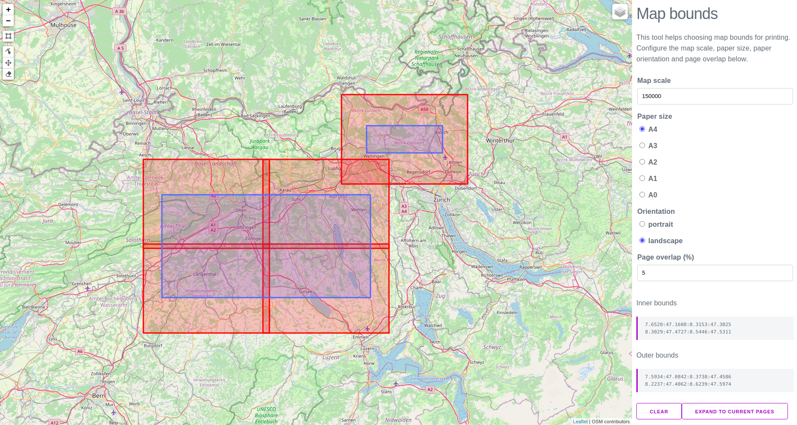
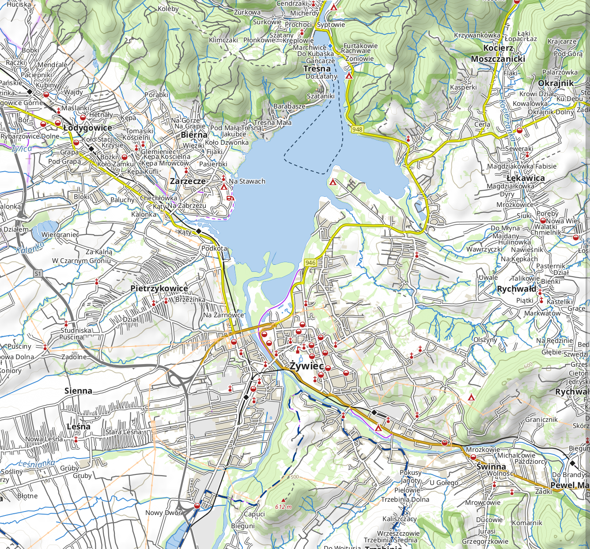

## Generating a custom cycling map with Mapnik and Carto

View the blogpost describing this project at https://dev.to/hiddewie/creating-a-custom-cycling-map-3g2a.

View the [examples](#examples) below.

## Cartography and features

[Cartography](docs/cartography.md)

[Features](docs/features.md)

## Getting started

There are three scripts in this repository:
- [`scripts/download.sh`](scripts/download.sh)

  Downloads the required data into a Postgres database for the map.
- [`scripts/generate.py`](scripts/generate.py)

  A Python script which will generate the map for a Mapnik configuration. The Mapnik configuration can be generated by running
  Carto against `carto/project.mml`.
- [`scripts/bounds.py`](scripts/bounds.py)

  A Python script which will output a list of bounding boxes that will fit the configured page size and bounding box perfectly.

See the environment variables which can be configured for the scripts below.

Copy the distributed environment file [`.env.dist`](.env.dist) to `.env`. Fill in the required credentials for the [U.S. Geological Survey](https://www.usgs.gov/). You can modify the `.env` file to suit your needs.

The scripts are packaged as Docker images, and configured in the file [`docker-compose.yml`](./docker-compose.yml).

#### Database

Start a database with GIS extensions enabled using the image [`postgis/postgis`](https://hub.docker.com/r/postgis/postgis):
```bash
docker compose -d up postgres-osm
```

The data will be stored durably in the directory `postgres`.

Used technology:
- [PostgreSQL](https://www.postgresql.org/)
- [PostGIS extension](https://postgis.net/install/)

#### Map bounds

Determine the bounding box of the region you want to print. The bounding box will be used to determine the number of pages to print. If everything fits on one page (of the configured paper size) then padding is added until the page is filled exactly. If the content needs more than one page, then multiple tiled pages are generated to cover the bounding box area, with the configured page overlap (5% by default).

The [Map bounds tool](https://hiddewieringa.nl/map-bounds) can be used to choose coordinates on a map in a visual manner.

[](https://hiddewieringa.nl/map-bounds)

In addition to the visual tool, the script container [`hiddewie/map-it-bounds`](https://hub.docker.com/r/hiddewie/map-it-bounds) can be used. This commandline tool contains the same logic in the visual tool and as in the map generation script. The output will contain the bounding boxes for each page that will be generated. These values can be used for other commands.
```bash
docker compose run map-it-bounds
```

(You can also build it yourself using `docker compose build map-it-bounds`)

#### Data download & import

Make sure you have created an account [U.S. Geological Survey](https://www.usgs.gov/). The USGS service is used to download terrain height information in high resolution.

Then, download and import the data of the map using the docker image [`hiddewie/map-it-import`](https://hub.docker.com/r/hiddewie/map-it-import). Map the data directory of this project to the container. Some files are downloaded there that are used for shading the map. Run it using
```bash
docker compose run map-it-import
```

(You can also build it yourself using `docker compose build map-it-import`)

Additionally, you can import a `.gpx` file to visualize on the map using the `GPX_FILE` environment variable. Importing a `.gpx` file will replace the OpenStreetMap cycling routes on the map.  

Used technology:
- [Phyghtmap](http://katze.tfiu.de/projects/phyghtmap/phyghtmap.1.html)
- [Osmium(-tool)](https://osmcode.org/osmium-tool/)
- [`osm2psql`](https://osm2pgsql.org/)
- [`shp2pgsql`, part of PostGIS](https://postgis.net/docs/using_postgis_dbmanagement.html#shp2pgsql_usage)
- [GDAL](https://gdal.org/index.html)
- [GeoFabrik](http://download.geofabrik.de/) as a data source for OSM data
- [U.S. Geological Survey](https://www.usgs.gov/) as a data source for elevation data

#### Map

Let's generate a map. Use the image [`hiddewie/map-it`](https://hub.docker.com/r/hiddewie/map-it) and run it using
```bash
docker compose run map-it
```

The map will be written to the mapped volume in the `/output` directory. The mapnik XML config will also be written there.

The bounding box does not need to fit perfectly on one page. If it does not, padding will be added or multiple pages will be generated.

(You can also build it yourself using `docker compose build map-it`)

Used technology:
- [CartoCSS](https://github.com/mapbox/carto)
- [Mapnik](https://mapnik.org/)
- Icons from [OpenStreetMap Carto style](https://github.com/gravitystorm/openstreetmap-carto)

##### Legend

The same Docker image can also generate a legend in the output folder.

```bash
docker compose run map-it legend.sh
```

The legend will be generated in the `output/legend.pdf` file.


Used technology:
- [CartoCSS](https://github.com/mapbox/carto)
- [Mapnik](https://mapnik.org/)
- Icons from [OpenStreetMap Carto style](https://github.com/gravitystorm/openstreetmap-carto)

##### Tiles

The same Docker image can also generate tiles in the output folder. Instead of generating a PDF map, these tiles can be used
for a sliding online map.

```bash
docker compose run map-it tiles.sh
```

The tiles will be generated in the `output/tiles` directory.

<p align="center">
   
</p>

Used technology:
- [CartoCSS](https://github.com/mapbox/carto)
- [Mapnik](https://mapnik.org/)
- Icons from [OpenStreetMap Carto style](https://github.com/gravitystorm/openstreetmap-carto)
- Tile rendering script based on [generate_tiles.py](https://github.com/openstreetmap/mapnik-stylesheets/blob/236f8d0/generate_tiles.py)

### Script parameters

The lists below describe the parameters used for the scripts, including defaults.

#### Import script

<dl>
  <dt><tt>PG_HOST</tt> (default <tt>localhost</tt>)</dt>
  <dd>The Postgres database host</dd>

  <dt><tt>PG_PORT</tt> (default <tt>5432</tt>)</dt>
  <dd>The Postgres database port</dd>

  <dt><tt>PG_USER</tt> (default <tt>osm</tt>)</dt>
  <dd>The Postgres database user</dd>

  <dt><tt>PG_PASSWORD</tt> (default empty)</dt>
  <dd>The Postgres database password</dd>

  <dt><tt>PG_DATABASE</tt> (default <tt>gis</tt>)</dt>
  <dd>The Postgres database</dd>

  <dt><tt>PG_LEGEND_DATABASE</tt> (default <tt>legend</tt>)</dt>
  <dd>The Postgres database where the legend will be stored</dd>

  <dt><tt>FEATURE_COUNTRIES</tt> (required, default empty)</dt>
  <dd>Countries that will be downloaded from <a href="http://download.geofabrik.de">GeoFabrik</a>. Separated by whitespace. For example <tt>europe/netherlands/overijssel europe/slovakia europe/poland/slaskie europe/poland/malopolskie</tt>.</dd>

  <dt><tt>USGS_USERNAME</tt> and <tt>USGS_PASSWORD</tt> (required, default empty)</dt>
  <dd>Create an account for accessing <a href="https://www.usgs.gov/">U.S. Geological Survey</a> for terrain information. This can be done for free <a href="https://store.usgs.gov/user/register">. Set the credentials in these environment variables.<br>
  The <a href="http://katze.tfiu.de/projects/phyghtmap/phyghtmap.1.html">phyghtmap</a> tool is used for downloading terrain information.</dd>

  <dt><tt>BBOX</tt> (required, default empty)</dt>
  <dd>Of the form <tt>A:B:C:D</tt>, for example <tt>5.3:51.1:6.8:53.0056</tt> where <tt>(A, B)</tt> is the lower left corner of the bounding box and <tt>(C, D)</tt> is the top right corner. Specify in longitude - latitude order in the <a href="https://epsg.io/4326">EPSG:4326</a> coordinate system.</dd>

  <dt><tt>GPX_FILE</tt> (default empty)</dt>
  <dd>A path to a <tt>.gpx</tt> file mounted in the Docker image. The <tt>.gpx</tt> file will be imported and shown on the map instead of OSM cycling routes.</dd>
</dl>

Optional extra parameters for tweaking the import of downloaded OpenStreetMap data into the database:

<dl>
  <dt><tt>OSM2PGSQL_CACHE</tt> (default <tt>1024</tt>)</dt>
  <dd>The cache size in mega bytes that the import script may use.</dd>

  <dt><tt>OSM2PGSQL_NUMPROC</tt> (default <tt>4</tt>)</dt>
  <dd>The number of processes that import script may use.</dd>
</dl>

#### Map generation & bounding box script

<dl>
  <dt><tt>PG_HOST</tt> (default <tt>localhost</tt>)</dt>
  <dd>The Postgres database host</dd>

  <dt><tt>PG_PORT</tt> (default <tt>5432</tt>)</dt>
  <dd>The Postgres database port</dd>

  <dt><tt>PG_USER</tt> (default <tt>osm</tt>)</dt>
  <dd>The Postgres database user</dd>

  <dt><tt>PG_PASSWORD</tt> (default empty)</dt>
  <dd>The Postgres database password</dd>

  <dt><tt>PG_DATABASE</tt> (default <tt>gis</tt>)</dt>
  <dd>The Postgres database</dd>

  <dt><tt>PG_LEGEND_DATABASE</tt> (default <tt>legend</tt>)</dt>
  <dd>The Postgres database where the legend will be stored</dd>

  <dt><tt>MAP_NAME</tt> (default <tt>map</tt>)</dt>
  <dd>The name of the map. Used for generating filenames. Existing files will be overwritten. When multiple pages are generated, they are all added to the same PDF file.</dd>

  <dt><tt>BBOX</tt> (required, default empty)</dt>
  <dd>Of the form <tt>A:B:C:D</tt>, for example <tt>5.3:51.1:6.8:53.0056</tt> where <tt>(A, B)</tt> is the lower left corner of the bounding box and <tt>(C, D)</tt> is the top right corner. Specify in longitude - latitude order in the <a href="https://epsg.io/4326">EPSG:4326</a> coordinate system. Multiple bounding boxes maybe concatenated with <tt>,</tt>.</dd>

  <dt><tt>SCALE</tt> (default <tt>1:150000</tt>)</dt>
  <dd>The scale of the map, when printed on the indicated paper size. The value is of the form <tt>1:N</tt> with <tt>N</tt> a number.</dd>

  <dt><tt>PAPER_ORIENTATION</tt> (default <tt>portrait</tt>)</dt>
  <dd>The orientation of the generated page. Valid values: <tt>portrait</tt> and <tt>landscape</tt>.</dd>

  <dt><tt>PAPER_SIZE</tt> (default <tt>A4</tt>)</dt>
  <dd>The size of the generated page. Valid values: <tt>A0</tt>, <tt>A1</tt>, <tt>A2</tt>, <tt>A3</tt>, <tt>A4</tt> and <tt>A5</tt>, or any value of the form <tt>A mm x B mm</tt> (millimeters), <tt>A in x B in</tt> (inches) or <tt>A m x B m</tt> (meters) with <tt>A</tt> and <tt>B</tt> numeric values. For example <tt>A1</tt>, <tt>10 mm x 100 mm</tt> or <tt>20 in x 5 in</tt>.</dd>

  <dt><tt>PAGE_OVERLAP</tt> (default <tt>5%</tt>)</dt>
  <dd>A percentage of the form '5%' or '10.1%'. The percentage of each page is taken on all four sides of the paper as padding. When multiple pages are generated the padding will cause overlap between the pages.</dd>
</dl>

#### Tile generation script

<dl>
  <dt><tt>PG_HOST</tt> (default <tt>localhost</tt>)</dt>
  <dd>The Postgres database host</dd>

  <dt><tt>PG_PORT</tt> (default <tt>5432</tt>)</dt>
  <dd>The Postgres database port</dd>

  <dt><tt>PG_USER</tt> (default <tt>osm</tt>)</dt>
  <dd>The Postgres database user</dd>

  <dt><tt>PG_PASSWORD</tt> (default empty)</dt>
  <dd>The Postgres database password</dd>

  <dt><tt>PG_DATABASE</tt> (default <tt>gis</tt>)</dt>
  <dd>The Postgres database</dd>

  <dt><tt>BBOX</tt> (required, default empty)</dt>
  <dd>Of the form <tt>A:B:C:D</tt>, for example <tt>5.3:51.1:6.8:53.0056</tt> where <tt>(A, B)</tt> is the lower left corner of the bounding box and <tt>(C, D)</tt> is the top right corner. Specify in longitude - latitude order in the <a href="https://epsg.io/4326">EPSG:4326</a> coordinate system. Multiple bounding boxes maybe concatenated with <tt>,</tt>.</dd>

  <dt><tt>NUM_THREADS</tt> (required, default <tt>6</tt>)</dt>
  <dd>The number of threads that will be used to concurrently render tiles.</dd>

  <dt><tt>MIN_ZOOM</tt> and <tt>MAX_ZOOM</tt> (required, both default <tt>12</tt>)</dt>
  <dd>The minimum and maximum zoom level to generate.</dd>

  <dt><tt>TMS_SCHEME</tt> (<tt>true</tt> or <tt>false</tt>, default <tt>false</tt>)</dt>
  <dd>Generate tiles for schemes with the TMS format of the <tt>y</tt> coordinate.</dd>

  <dt><tt>SKIP_IF_EXISTS</tt> (<tt>true</tt> or <tt>false</tt>, default <tt>true</tt>)</dt>
  <dd>Whether tile generation should be skipped if the tile file already exists.</dd>
</dl>

## Examples

[Example PDF Output](https://github.com/hiddewie/map-it/releases/download/v5.0.0/map.pdf)




## Local development

You can run and develop the map style locally by using the Kosmtik interface.

Run Kosmtik with
```bash
docker compose run kosmtik
```

Go to [http://localhost:6789/map-it](http://localhost:6789/map-it).


