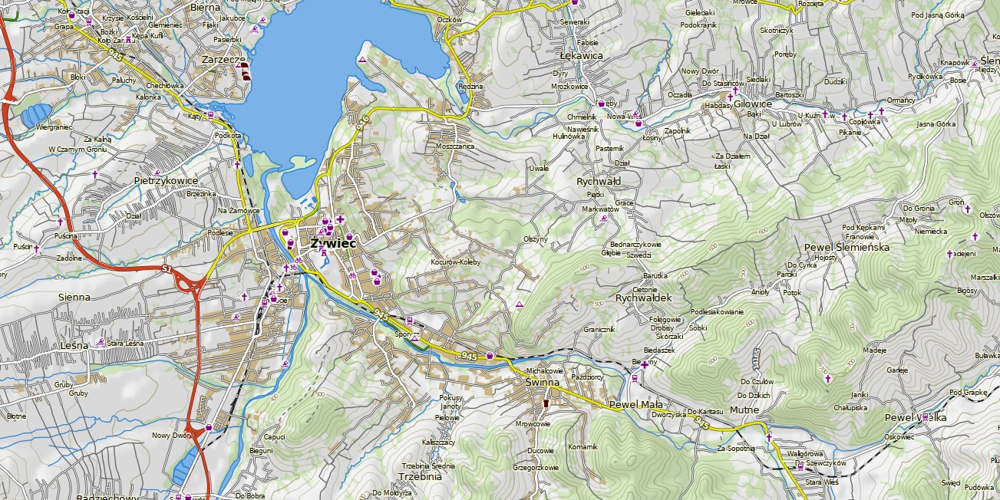
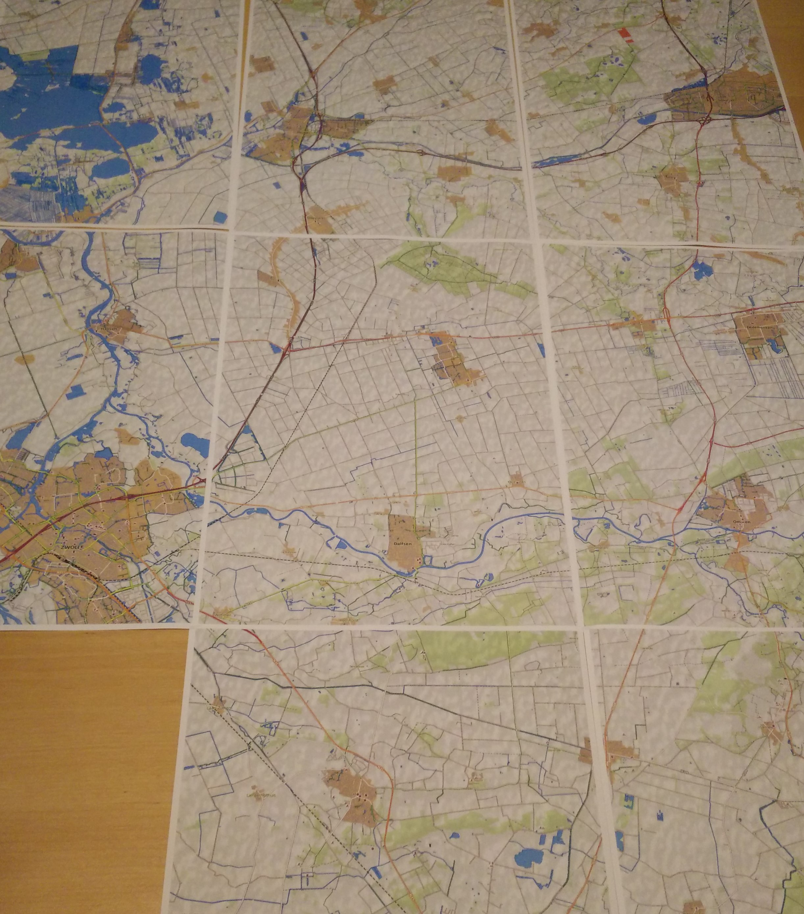

## Generating a custom cycling map with Mapnik

View blogpost at https://dev.to/hiddewie/creating-a-custom-cycling-map-3g2a.

## Getting started

There are two scripts in this repository:
- `download.sh`

  Downloads the required data into a Postgres database for the map.
- `generate.py`

  A Python script which will generate the map. 
  
See the environment variables which can be configured for both scripts below.

### Manually

Make sure you have a running Postgres database, with a `gis` schema with GIS extensions enabled.

Run the command
```shell script
./download.sh
```
to download the data and insert it into the database.

Run the command 
```shell script
./generate.py
```
to generate the Mapnik XML configuration and the printable PDF map in the folder `output`.

You may edit the constants in the download and generate scripts to generate maps for other countries.

### Using Docker

Start a database with GIS extensions enabled using the image `openfirmware/postgres-osm`
```bash
docker run -d --name postgres-osm openfirmware/postgres-osm
```

Then, download and import the data of the map using the docker image `hiddewie/map-it-import` [](https://hub.docker.com/r/hiddewie/map-it-import). Map the data directory of this project to the container. Some files are downloaded there that are used for shading the map. Run it using
```bash
docker run \
  -ti \
  --rm \
  -v $PROJECT_DIR/data:/data \
  --link postgres-osm:postgres-osm \
  -e PG_HOST=postgres-osm \
  -e PG_PORT=5432 \
  -e PG_USER="osm" \
  -e PG_PASSWORD="" \
  -e PG_DATABASE="gis" \
  -e FEATURE_COUNTRIES="europe/netherlands/overijssel" \
  -e LATITUDES="N52" \
  -e LONGITUDES="E006" \
  hiddewie/map-it-import
```
where `$PROJECT_DIR` is the project directory.

(You can also build it yourself using `docker build -t map-it-import -f import.Dockerfile .`)

Let's generate a map. Use the image `hiddewie/map-it` [](https://hub.docker.com/r/hiddewie/map-it) and run it using 
```bash
docker run -ti \
  --rm \
  -v $PROJECT_DIR/data:/map-it/data \
  -v $PROJECT_DIR/output:/map-it/output \
  --link postgres-osm:postgres-osm \
  -e PG_HOST=postgres-osm \
  -e PG_PORT=5432 \
  -e PG_USER="osm" \
  -e PG_PASSWORD="" \
  -e PG_DATABASE="gis" \
  -e MAP_NAME="map" \
  -e LATITUDES="N52" \
  -e LONGITUDES="E006" \
  -e TOP_LEFT_X="735324" \
  -e TOP_LEFT_Y="6874058" \
  -e OFFSET_PAGES_X="0" \
  -e OFFSET_PAGES_Y="0" \
  -e PAGES_HORIZONTAL="1" \
  -e PAGES_VERTICAL="1" \
  hiddewie/map-it
```

The map will be written to the mapped volume in the `/output` directory. The mapnik XML config will also be written there.

(You can also build it yourself using `docker build -t map-it .`)

### Scipt parameters

The lists below describe the parameters used for the scripts, including defaults.

#### Import script

- `PG_HOST` (default `localhost`)
  
  The Postgres database host
- `PG_PORT` (default `5432`)
  
  The Postgres database port
- `PG_USER` (default `osm`)
  
  The Postgres database user
- `PG_PASSWORD` (default empty)
  
  The Postgres database password
- `PG_DATABASE` (default `gis`)
  
  The Postgres database host
- `COUNTRIES` (default empty)
  
  Regex of the countries which to download the national for, as listed in `countries.txt`. Separated with `|`. For example `Burundi|Cayman Islands`
- `FEATURE_COUNTRIES` (default empty)
  
  Countries that will be downloaded from [GeoFabrik](http://download.geofabrik.de/). Separated by whitespace. For example `europe/netherlands/overijssel europe/slovakia europe/poland/slaskie europe/poland/malopolskie`.
- `LATITUDES` (default empty)
  
  Latitude values that will be downloaded from [U.S. Geological Survey](https://www.usgs.gov/) for terrain information. Of the format `[NS][0-9]{2}` (regex). Separated by whitespace. For example `N52 S01`.
- `LONGITUDES` (default empty)
  
  Longitude values that will be downloaded from [U.S. Geological Survey](https://www.usgs.gov/) for terrain information. Of the format `[EW][0-9]{3}` (regex). Separated by whitespace. For example `E002 W150`.

All combinations of latitude/longitude pairs will be downloaded.

#### Map generation script

- `PG_HOST` (default `localhost`)
  
  The Postgres database host
- `PG_PORT` (default `5432`)
  
  The Postgres database port
- `PG_USER` (default `osm`)
  
  The Postgres database user
- `PG_PASSWORD` (default empty)
  
  The Postgres database password
- `PG_DATABASE` (default `gis`)
  
  The Postgres database host
- `MAP_NAME` (default `map`)
  
  The name of the map. Used for generating filenames. Existing files will be overwritten. The filename will be suffixed with the index of the generated page if more than one page is generated (see `PAGES_HORIZONTAL` and `PAGES_VERTICAL`). 
- `TOP_LEFT_X`, `TOP_LEFT_Y` (both default empty)
  
  The [EPSG:3857](https://epsg.io/3857) coordinates of the top-left corner of the map.
- `OFFSET_PAGES_X`, `OFFSET_PAGES_Y` (both default `0`)
  
  The offset of pages to generate. Useful for automating generating multiple tiled maps.
- `SCALE` (default `1:150000`)
  
  The scale of the map, when printed on the indicated paper size. The value is of the form `1:N` with `N` a number.
- `PAPER_ORIENTATION` (default `portrait`)
  
  The orientation of the generated page. Valid values: `portrait` and `landscape`.
- `PAPER_SIZE` (default `A4`)
  
  The size of the generated page. Valid values: `A0`, `A1`, `A2`, `A3` and `A4`, or any value of the form `A mm x B mm` (millimeters), `A in x B in` (inches) or `A m x B m` (meters) with `A` and `B` numeric values. For example `A1`, `10 mm x 100 mm` or `20 in x 5 in`.
- `PAGES_HORIZONTAL` (default `1`)
  
  The number of pages to generate in the horizontal direction.
- `PAGES_VERTICAL` (default `1`)
  
  The number of pages to generate in the vertical direction.

### Examples

[Example PDF Output](https://github.com/hiddewie/map-it/releases/download/v1.0.0/output.pdf)




